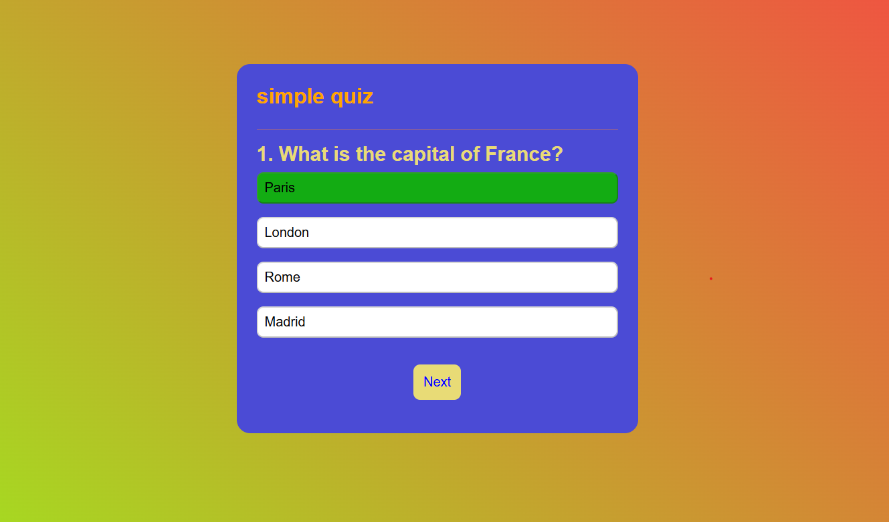

# 🧠 Simple Quiz App

تطبيق كويز بسيط بـ HTML و CSS و JavaScript  
يعرض أسئلة اختيار من متعدد، ويحسب النتيجة ويعرضها للمستخدم.

---

## 🌍 رابط المشروع الحي

[🔗 جرب التطبيق الآن](https://antonious-sameh.github.io/simple-quiz-app/)

---

## 🖼️ صورة للمشروع

---

## 💡 مميزات المشروع

- ✅ عرض سؤال واحد في كل مرة
- ✅ تغيير تلقائي بعد الإجابة
- ✅ توضيح الإجابة الصحيحة باللون الأخضر والخاطئة بالرمادي
- ✅ عرض النتيجة النهائية
- ✅ زر لإعادة المحاولة من البداية
- ✅ تأثيرات جميلة بالـ CSS عند الضغط والتحويم

- ## 🛠️ التقنيات المستخدمة

- HTML5
- CSS3 (Transitions - Hover Effects - Colors)
- JavaScript (DOM, Array, Events)

